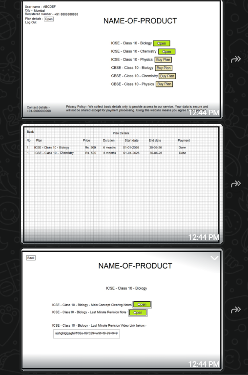

# Neuron by ELV - Learn Differently

A premium study materials platform for Class 10 students, offering comprehensive PDFs, video lectures, and subscription-based access to educational content.



## 🎯 Overview

Neuron by ELV is a full-stack EdTech application that provides students with access to quality study materials across multiple education boards (ICSE, CBSE, State Boards). The platform features a secure subscription system powered by Razorpay, an admin panel for content management, and robust content protection measures.

## ✨ Features

### For Students
- **Subject Dashboard** - Browse available subjects by board with pricing
- **Subscription System** - Purchase access to subjects via Razorpay
- **Material Viewer** - Access PDFs and video lectures with watermark protection
- **My Plans** - View active subscriptions and expiry dates
- **Profile Management** - Update personal information and password
- **Updates Drawer** - View announcements and free resources from admin

### For Administrators
- **Dashboard Analytics** - View total users, subjects, subscriptions, and revenue
- **Board Management** - Add, edit, and delete education boards
- **Subject Management** - CRUD operations with visibility toggle
- **Material Management** - Add PDFs (Google Drive) and Videos (Bunny.net)
- **Updates Management** - Create announcements, share free PDFs/videos with students
- **User Management** - View registered users
- **Subscription Tracking** - Monitor active and expired subscriptions
- **Payment History** - Track all transactions

### Security Features
- JWT-based authentication for users and admins
- Content protection (disabled right-click, keyboard shortcuts)
- Dynamic email watermark on materials
- Print protection via CSS
- Secure payment verification

## 🛠 Tech Stack

| Layer | Technology |
|-------|------------|
| Frontend | React 19, Vite, Tailwind CSS, Shadcn/UI |
| Backend | FastAPI, Python 3.11+ |
| Database | MongoDB |
| Payments | Razorpay |
| Icons | Lucide React |

## 📁 Project Structure

```
neuron-by-elv/
├── backend/
│   ├── server.py          # FastAPI application
│   ├── requirements.txt   # Python dependencies
│   └── .env              # Backend environment variables
├── frontend/
│   ├── src/
│   │   ├── components/   # Reusable UI components
│   │   ├── pages/        # Page components
│   │   │   └── admin/    # Admin panel pages
│   │   ├── lib/          # Utility functions
│   │   └── hooks/        # Custom React hooks
│   ├── public/           # Static assets
│   ├── index.html        # Entry HTML
│   ├── vite.config.js    # Vite configuration
│   └── .env              # Frontend environment variables
├── memory/
│   └── PRD.md            # Product Requirements Document
└── README.md             # This file
```

## 🚀 Getting Started

### Prerequisites
- Node.js 18+
- Python 3.11+
- MongoDB
- Razorpay Account

### Backend Setup

```bash
cd backend

# Create virtual environment
python -m venv venv
source venv/bin/activate  # On Windows: venv\Scripts\activate

# Install dependencies
pip install -r requirements.txt

# Configure environment
cp .env.example .env
# Edit .env with your MongoDB URI and other settings

# Run server
uvicorn server:app --host 0.0.0.0 --port 8001 --reload
```

### Frontend Setup

```bash
cd frontend

# Install dependencies
yarn install

# Configure environment
cp .env.example .env
# Edit .env with your backend URL and Razorpay key

# Run development server
yarn dev

# Build for production
yarn build
```

## 🔐 Environment Variables

### Backend (.env)
```
MONGO_URL=mongodb://localhost:27017
DB_NAME=neuron_db
JWT_SECRET=your-secret-key
RAZORPAY_KEY_ID=your-razorpay-key
RAZORPAY_KEY_SECRET=your-razorpay-secret
```

### Frontend (.env)
```
REACT_APP_BACKEND_URL=http://localhost:8001
REACT_APP_RAZORPAY_KEY_ID=your-razorpay-key
```

## 📱 Pages & Routes

### Client Routes
| Route | Description |
|-------|-------------|
| `/` | Redirect to dashboard or auth |
| `/auth` | Login/Register page |
| `/dashboard` | Subject listing |
| `/my-plans` | User's active subscriptions |
| `/settings` | Profile management |
| `/materials/:subjectId` | Material viewer |
| `/privacy` | Privacy Policy |
| `/terms` | Terms of Service |
| `/refund` | Refund Policy |
| `/cancellation` | Cancellation Policy |

### Admin Routes
| Route | Description |
|-------|-------------|
| `/admin` | Admin login & dashboard |

## 🔌 API Endpoints

### Authentication
- `POST /api/auth/register` - User registration
- `POST /api/auth/login` - User login
- `GET /api/auth/me` - Get current user

### Subjects & Materials
- `GET /api/subjects` - List visible subjects
- `GET /api/materials/:subjectId` - Get materials (requires subscription)

### Payments
- `POST /api/payments/order` - Create Razorpay order
- `POST /api/payments/verify` - Verify payment & create subscription

### Admin
- `POST /api/admin/login` - Admin authentication
- `GET /api/admin/stats` - Dashboard statistics
- CRUD endpoints for boards, subjects, materials
- GET endpoints for users, subscriptions, payments

## 🧪 Test Credentials

### Admin
- **URL:** `/admin`
- **Email:** `admin@neuronlearn.com`
- **Password:** `admin123`

### User
Create a new account via the registration page.

## 📄 License

© 2026 Neuron by ELV. All rights reserved.

## 📞 Support

- **Email:** support@neuronlearn.com
- **Phone:** +91 98765 43210
